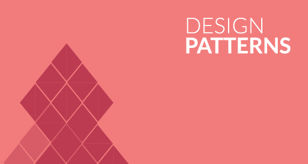

# Design Patterns
Design Patterns

- https://sourcemaking.com/
- https://www.tutorialspoint.com/design_pattern/index.htm

## create a new spring project from the scratch
First of all, you can generate the scaffolding of this project using the INITIALIZR tool: 
https://start.spring.io/

## Create a gradle project
```
gradle wrapper
./gradlew build copyDependencies
```
## Dockerize the app: create a docker image and run the project from command line
From the project root folder exec the commands to create a docker image and run it:

```bash
docker build -f docker/Dockerfile . -t designpatterns
docker run -p 8080:8080 designpatterns
docker stop $(docker ps -a -q)
docker rm $(docker ps -a -q)
```

# Patterns

- Creational stands for creating new objects hidden complexity and low coupling to the system 
- Structural stands for combining classes for working together reducing complexity and hidden complexity. Mainly act as wrappers, adapters or facades.
- Behavioral stands for encapsulating logic/algorithms, responsibilities and relationships. 


## Creational 

- Abstract Factory: create a parent and children classes. Use a factory to create a new one from the children
- Factory Method: define an abstract method in the parent class. Every child class has to implement in a different way.
- Singleton: create an single instance o several instances but no more. Control how much to create.
- Builder: a way to construct an object controlling every step of the creation.
- Prototype: the inheritance is done by cloning a class instead of inherit directly. 

## Structural

- Adapter: create a custom interface to receive some data, in order to process it and then pass it to the next class to get the outcomes.
- Bridge: decouple the structure/abstraction of the behavior creating two hierarchies in order to evolve them in an isolated way for combining them.
- Composite: creates an class for create a tree nodes, in order every node have a reference of another node up to arrive to the leafs.
- Decorator: wrap a class to add more behavior, more or less similar to the adapter
- Facade: create a class to be located in front of others to create a common interface and hide the complex of the system.
- Flyweight: the classes are sharing a specific/particular instance of an object to save memory
- Proxy: acts a mediator (waiter) between a client class and others in order to hide the complexity of the system and for providing what the client class needs.

## Behavioral

- Command: encapsulates request and applies the logic inside. The commmand object is passed to another which execute this.
- Chain of responsibility: every child of a hierarchy has a responsibility and a request is passed between all of them. Every child execute the request doing or not doing anything.
- Interpreter: to interpreter a language for instance. 
- Iterator: hide the complexity of an list of chidren and iterate between them.
- Mediator: collects some object and use them to get an outcome, but the object are indepedent between them.
- Memento: remember the previous state
- Observer/observable: publish/subscriber
- State: every child represents an state, the state of the system can change in every moment when the states objects are changing
- Strategy: change de behaviour dinamically. similar to state pattern
- template method: similar to factory method
- visitor: two hierarchies to combine them. 


### SOLID Principles

- S stands for Single responsability or expert: the main objective of a class is unique.
- O stands for Open Close principle: open to extend and close to change or modify.
- L stands for Liskov sustitution: a child class can be pass to another class as a parameter where the base clase is used.
- I stands for Interface Segregation: use several interfaces in order to reuse them instead of one which is less resuseable.
- D stands for Depency inyection: low coupling, inject the classes in order to avoid to know how are created and having less dependencies.

### GRASP Principles

- Low coupling, high cohesion
- Controller for the UI
- Creator for the factory pattern
- information expert or single responsability
- pure fabrication or service in the domain-driven design
- indirection or dependency injection
- polymorphism

### domain-driven design

### Reactive principles: manifesto

- https://www.reactivemanifesto.org


